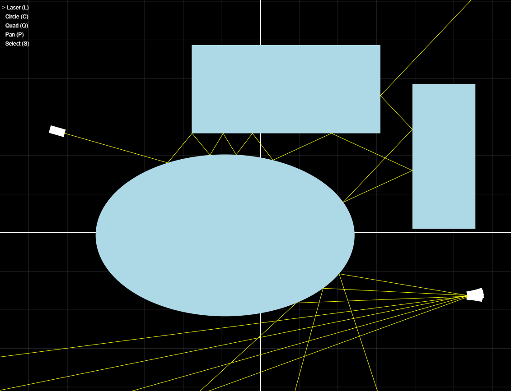

# Raymond

Play with Raymond at [papercuts.rcdis.co](papercuts.rcdis.co).

Raymond is a 2D optics simulator. I am building it to help me understand and explain concepts in [ray tracing](https://en.wikipedia.org/wiki/Ray_tracing_(graphics)).

To run Raymond locally, clone this repo and run `npx tsc` to compile the latest TypeScript code to JavaScript in `./dist`. Then run `npx live-server ./dist --no-browser` and visit `localhost:8080`.

Raymond is a static site, written in TypeScript and using [p5js](https://p5js.org/) for draw calls. It is deployed using [Disco](https://disco.cloud/).

